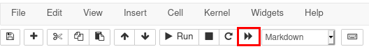
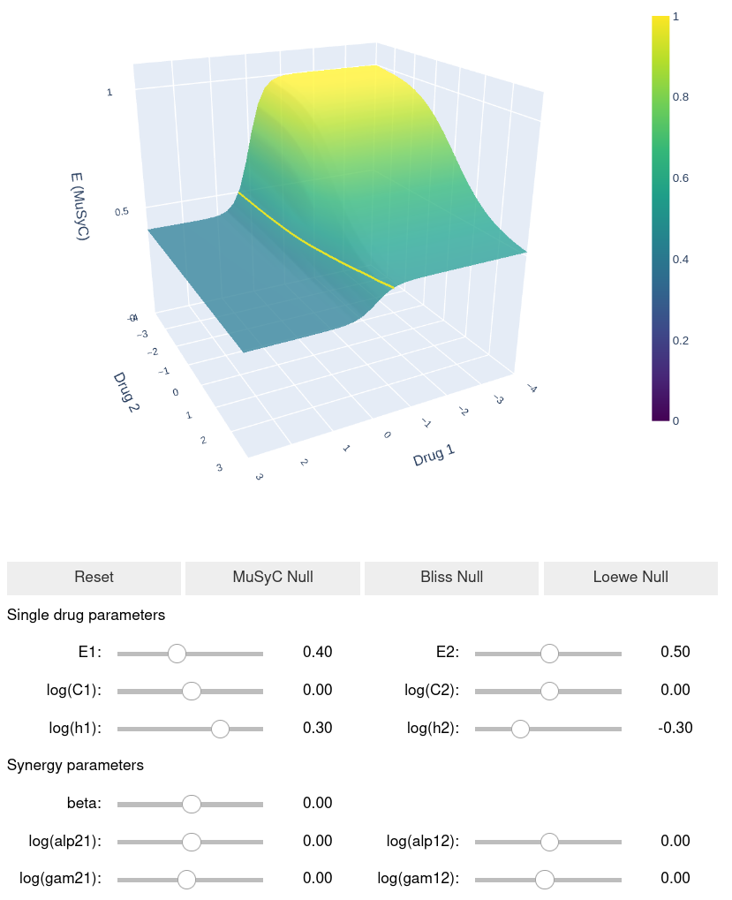

# MuSyC demo

This repository contains code for an interactive demo of the MuSyC synergy framework, and its relationship to other popular synergy frameworks (Bliss and Loewe).

It accompanies the paper

>Wooten DJ, Meyer CT, Lubbock ALR, Quaranta V, and Lopez CF. MuSyC is a Consensus Framework That Unifies Multi-Drug Synergy Metrics for Combinatorial Drug Discovery. Nature Communications (in press)

## Installation
You can access a live version online by clicking on the following "launch | binder" button (Note, this may take a while to setup the server. Additionally, you may need to whitelist mybinder.org on your adblocker if it will not load.)

Alternatively you can download the code from this repository, and run the `demo.ipynb` jupyter notebook on your own. `environment.yml` lists the packages required to run the demo.

## Instructions for use
When you first open the jupyter notebook, you will have to rerun all the cells. This can be done by clicking the double-right arrows (shown below highlighted in red)

Once the cells have finished running, you can adjust sliders, rotate, zoom, and explore the included synergy models. The MuSyC dose-resposne surface, and Bliss and Loewe synergy surface plots will respond in real time.

